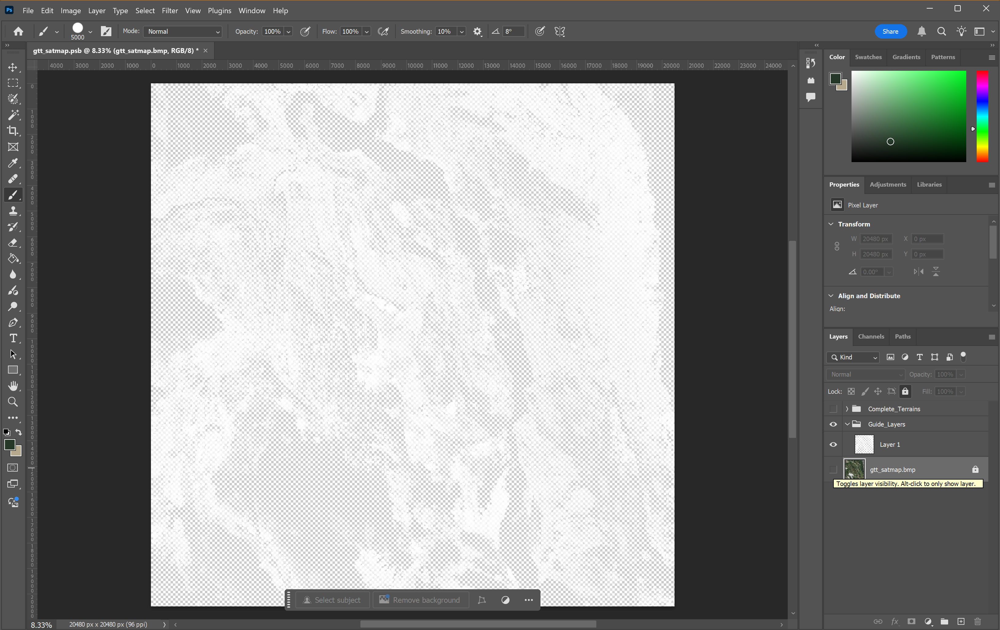

# PhotoShop Surface Mask

This guide assumes that you have completed the initial steps to start your map project, obtained your satellite map, and have a basic understanding of the purpose of your surface mask.

I will be using a `gtt_satmap.bmp` exported with **Game Terrain Tools** plugin on **QGIS**.

## Requirements
- Adobe PhotoShop
- Satellite Map
- RGB references from your `layers.cfg` file
- This [Reference Image](./images/LayerLegendComplete_v2.png) of terrain textures in-game may also help you along the way.
  - Credit to BergTheBeard in [DZ Academy Discord](https://discord.com/channels/728090560304382002/761156911398780958/1118673530394001528)

## Getting Started

 Open your sat map image in PhotoShop.

*Open your satellite map image in PhotoShop*

---
 In your toolbar: `Select` > `Color Range`

*Go to `Select` > `Color Range` in the toolbar*

---
- You'll be presented with the **Eyedropper Tool** as well as the **Color Range** modal.

*Adjust the `Fuzziness` slider and select a sample area.*

---
For this guide, I will select the dense forestry area to isolate the majority of trees into their own layer.

*Dense forestry area selected with Fuzziness set to `60`*

---
- `CTRL+C` to Copy the Selection.

- `CTRL+V` to Paste it into a new Layer.

*Hide your Alpha layer, select your new one.*

- Select > **Color Range** again, grab a sample from the new pasted layer, click `OK` to regain the selection.

---
With the area selected, open your **Color Picker** in the top right by double clicking the the two boxes on the side of it.

*Enter your desired terrain RGB values in the highlighted areas shown above.* 

**Remember**:  [Reference Image](images\LayerLegendComplete_v2.png) will assist in this, but ensure you're using the values defined in your `layers.cfg` as they may vary.

---
- Open the **Brush Tool** with `B` - may help to adjust your size to the maximum.
- Start painting away. Only the selection will be applied.

*Tip: Rename your layers as the terrain textures as you go to help you easily identfy them.*

---

## Repeat the Process

You'll want to repeat these steps for each area you want to define within your mask.

*Doing the same for the Snow covered areas, so on and so forth.*

---
**Tips:** Allow yourself up to 6 types of materials while doing this.

- *You can further refine & tune in areas where you are certain that the **limit of 6 "materials per cell"** is not going to be exceeded.*

- Depending on the complexity of your map, you may want to limit yourself to 4-5 layers of terrain colors.

- *This will allow you to add a layer for your Road shapes if you so choose to do so at the end (which I will cover later), as well as consideration of leaving yourself an available layer for a background material to be placed in (i.e. `grass`, etc.)*

- You can `Quick Export as PNG` by right-clicking a layer once it's complete. Save these to your `source` folder for safe keeping just in case you need to revert or make some adjustments going forward.
---

## Merging Down Layers
- Once you have completed the process a few times, the results should be something similar.

---
- Arrange the order of your layers to work as you desire, this will help to cover any areas that you want to be more prominent over any overlapping selections that may have been painted during the process.

- Once you're happy with the arrangement, you can right-click & `Merge Down` each layer starting from the top of the list and working your way down.
    - *Do **NOT** merge them into your Alpha satmap image.*

- Go ahead & `Quick Export as PNG` this merged version to your source for safe keeping as well.
---

## Background Material
- For your background material, copy & paste and existing layer, select it, and open up your **Color Picker**.
- Set your desired RGB value and paint the entire layer.

---
- Arrange the layer between your merged version and Alpha image:

*This will fill in any open transparent areas.* So far, we are at 5 materials total.

- Merge your merged version down on top of it.
---

## Adding Road Shapes

### Basically, from your project in Terrain Builder:
- Hide all `Raster` layers.

---

- Hide all `Object` layers.

---

- Hide all `Shapes` with the exception of your road shapes.

---

- You can refine road shape(s) `outline width` to better outline your actual roads according to their respective parts.
  - More information on **Chernarus** & **Enoch** road parts & their widths can be found here:

      [Bohemia Interactive Wiki - Road Tool](https://community.bistudio.com/wiki/DayZ:Using_Road_Tool_in_Terrain_Builder)

      [Sakhal Road References](/P3D_References/images/Sakhal_Road_Parts.png)

- With the shapes/polylines you wish to adjust selected:

---
- Apply a terrain texture to your road shapes by right-clicking a `shape layer` and selecting your desired choice. (i.e. `cp_concrete1`)
    - These are defined in your `layers.cfg` file.
- This will apply that assigned terrain texture material's RGB to the shape(s).
- **Be mindful:** 
    - *If you're applying numerous terrain textures to your shapes; these **do count** against the limit of total **"materials per cell"** (tile).*

---

- `File` > `Export` > `Shapes as Imagery` ..

---

- Save this export to your `source` folder for safe keeping.

#### You don't need to:
- Select `create a surface mask` in your TB project.
- Apply a background material.

---

- This should give you a `.png` of your road shapes and a black background.
- Drag & Drop this into **PhotoShop** from where you chose to save the export it to.
- `Select` > `Color Range` > Grab the black background areas > Hit `Delete` key.

- You may need to repeat this process or utilize the `Magic Wand Tool` to get any background areas that were not auto-selected.

---

- Once you've removed all the black background areas, `CTRL + A` to select the entire image.
  - Copy & Paste this as a layer into your active project where your mask is located.

---

- Place this layer on **top** of your merged version in the `Layers` tab of **PhotoShop**.
- Merge it down so that it overlays everything else.

---
## Converting `.png` to `.bmp`

Importing `.png` files into **Terrain Builder** can take a significant amount of time.

 In order to expedite the process, you will want to convert your exported `.png` versions into `.bmp`
 
 This can easily be done on sites like [Convertio](https://convertio.co/image-converter/) and [Online-Convert](https://image.online-convert.com) for free.

Keep in mind **Convertio** does have a 100mb file size limit; **Online-Convert**, does not.

Convert the images; download the results.

Your new `.bmp` version will be larger in file size than the `.png` but will import into **TB** much faster.